OOP - Enrollment System

---
**Author**: Miguel Santos

**1. Description** - Encapsulation of Student ID and Course ID

**Inheritance**

**ABSTRACTION**

**POLYMORPHISM**

Interfaces Used:
- StudentRegistration
- CourseRegistration
- IEnrollmentService
- IInstructorService

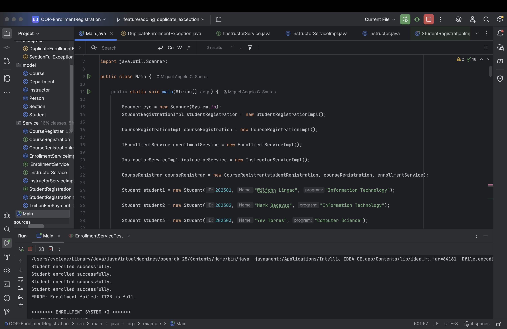

**VALIDATION AND ERROR HANDLING**

The system prevents crashes by using:
- Try-Catch Blocks
- Duplicate Validation
- Invalid Numeric Input Handling

Examples:
- Prevent duplicate Student IDs
- Prevent duplicate Instructor IDs
- Prevent invalid payment input
- Prevent invalid menu selections

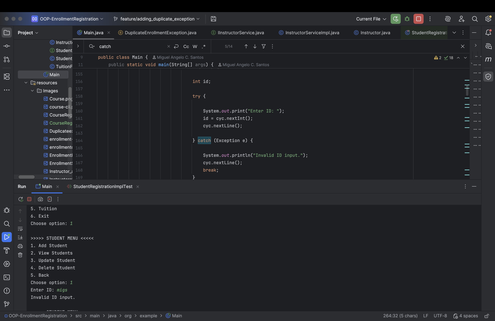

**CLI - STUDENT MANAGEMENT**

- Add Student
- View Student
- Update Student
- Delete Student

**CLI - INSTRUCTOR MANAGEMENT**

- Add Instructor
- View Instructor
- Update Instructor
- Delete Instructor

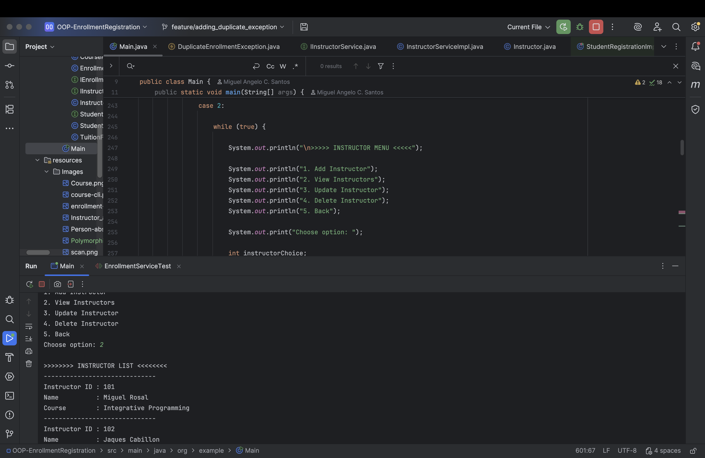

**CLI - COURSE MANAGEMENT**

- Add Course
- View Course
- Update Course
- Delete Course

**ENROLLMENT SYSTEM**

- Enroll Student
- View Department Hierarchy
- Section Capacity Validation

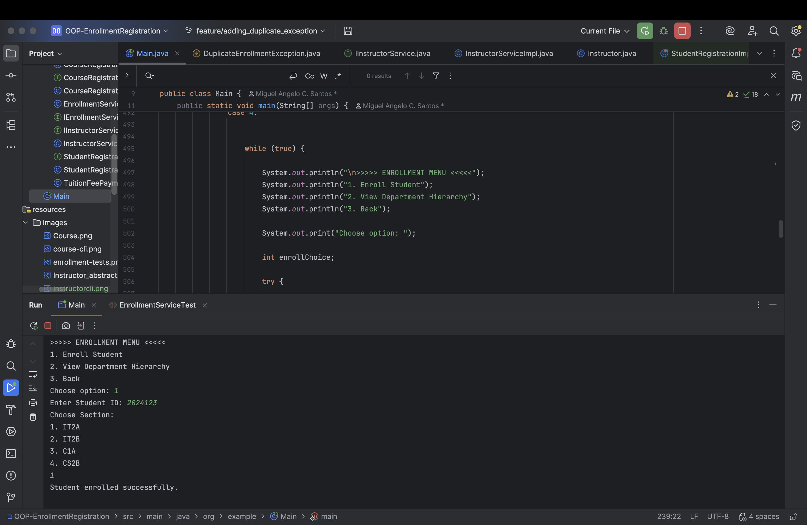

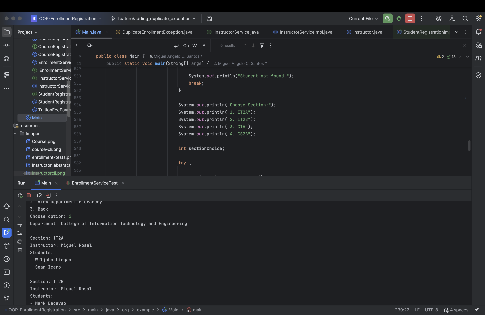

**CUSTOM EXCEPTION**

The system uses `SectionFullException and DuplicateEnrollmentException`
to prevent students from enrolling in full sections and to prevent students from enrolling in the same section

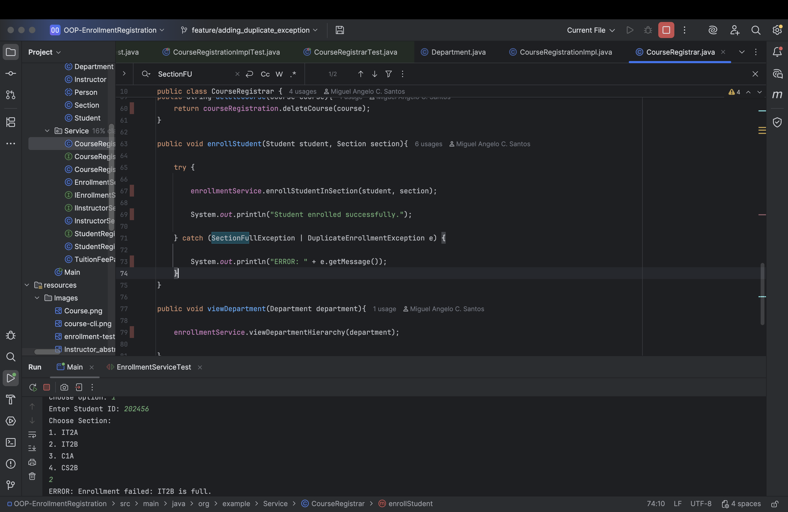
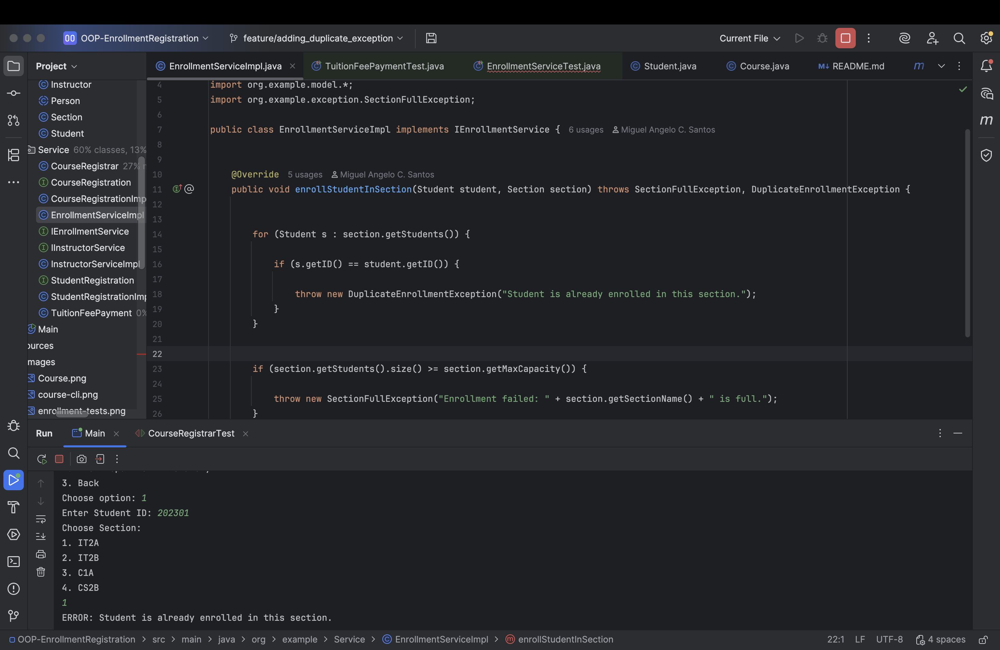

**TUITION MANAGEMENT**

Features:
- Tuition Fee Calculation
- Scholarship Discounts
- Payment Processing
- Remaining Balance Calculation
- Change Calculation

Scholarship Types:
- Academic Scholarship (50%)
- Athletic Scholarship (25%)

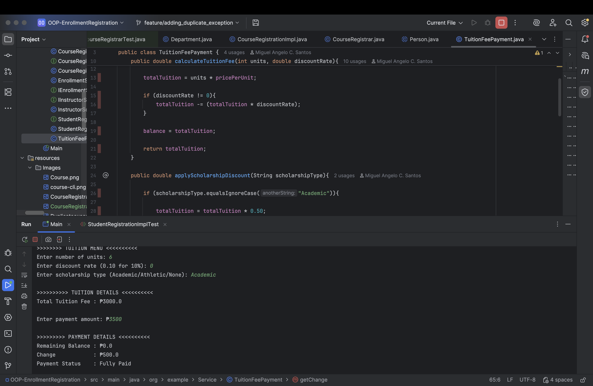

**AUTOMATED TESTING (JUnit)**

- Tuition Tests
- Enrollment Tests
- Validation Tests

Course Registrar Test
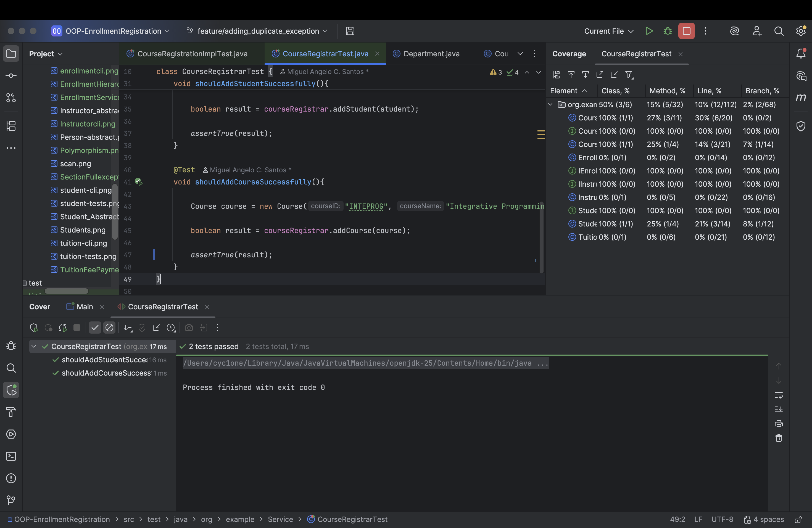

CourseRegistrationImpl Test
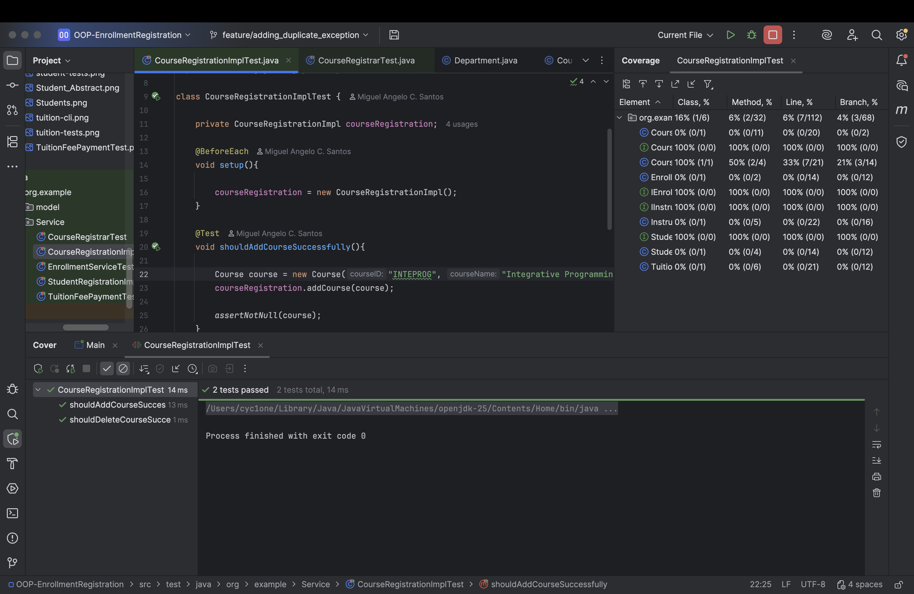

EnrollmentService Test
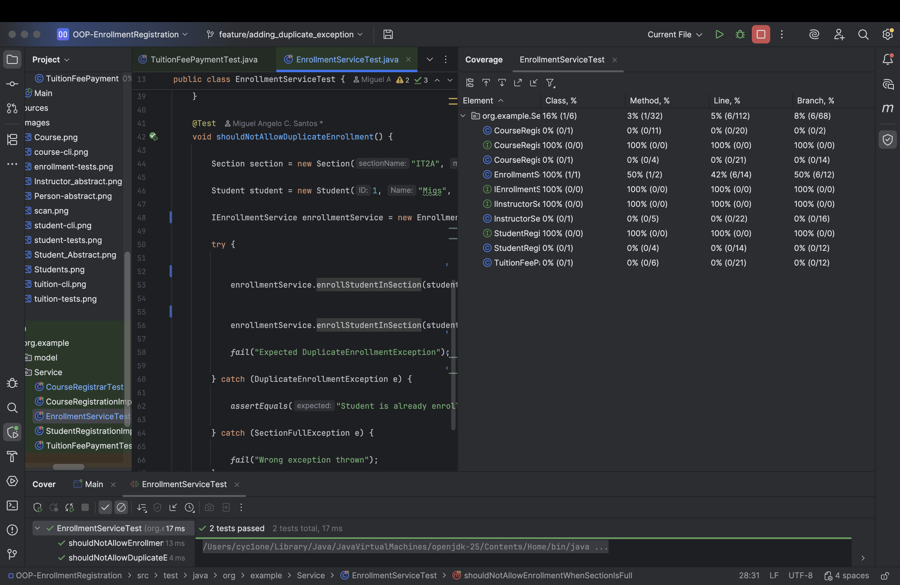

StudentRegistrationImpl Test
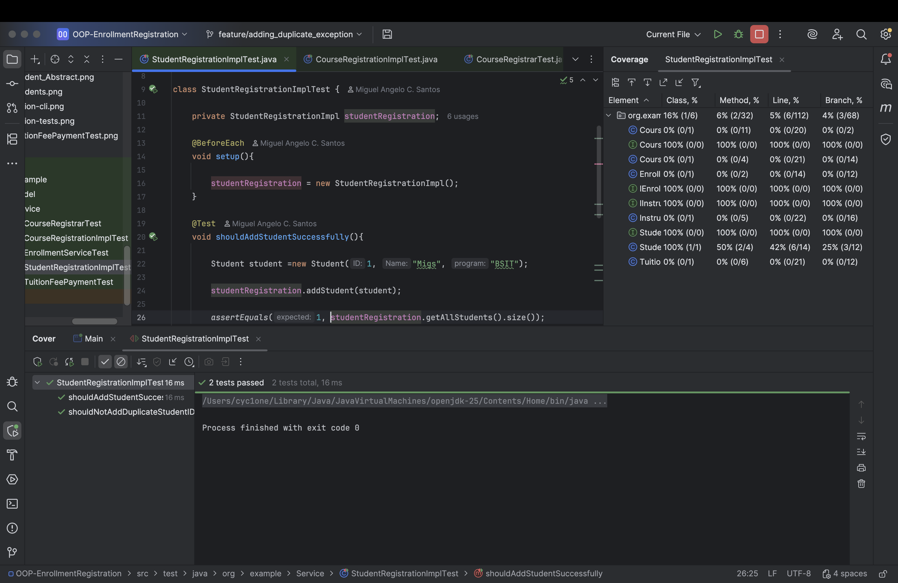

TuitionFeePayment Test
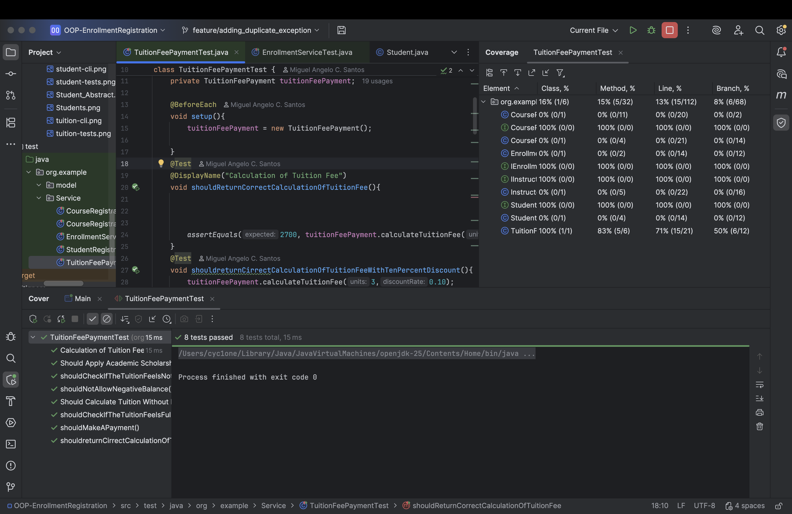