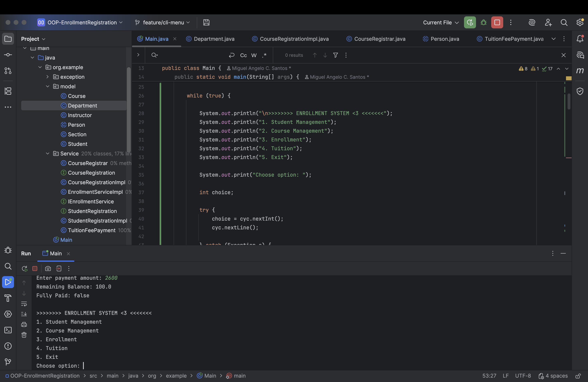
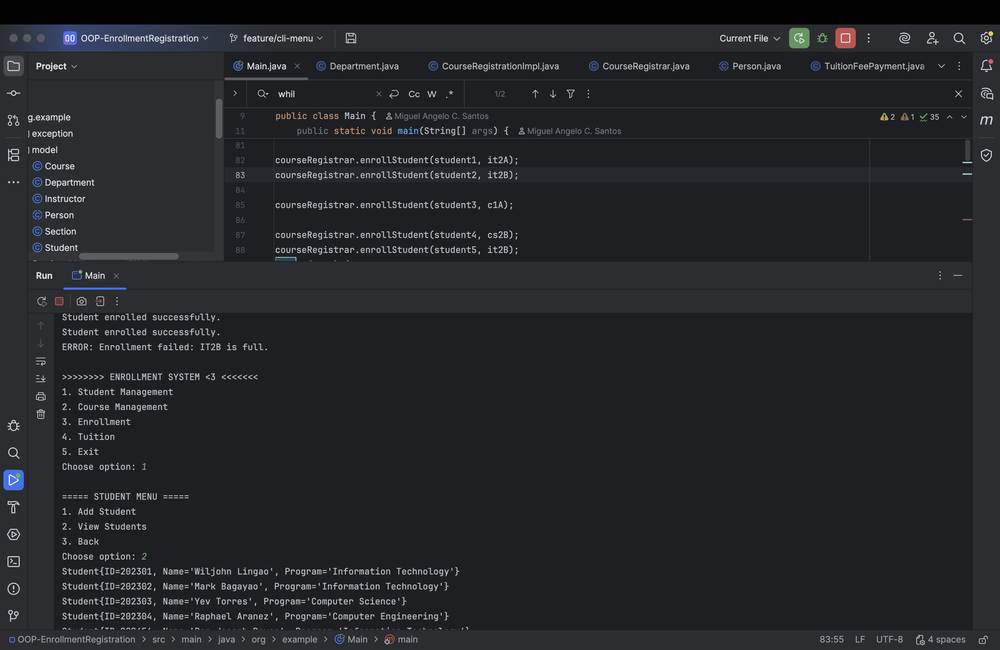
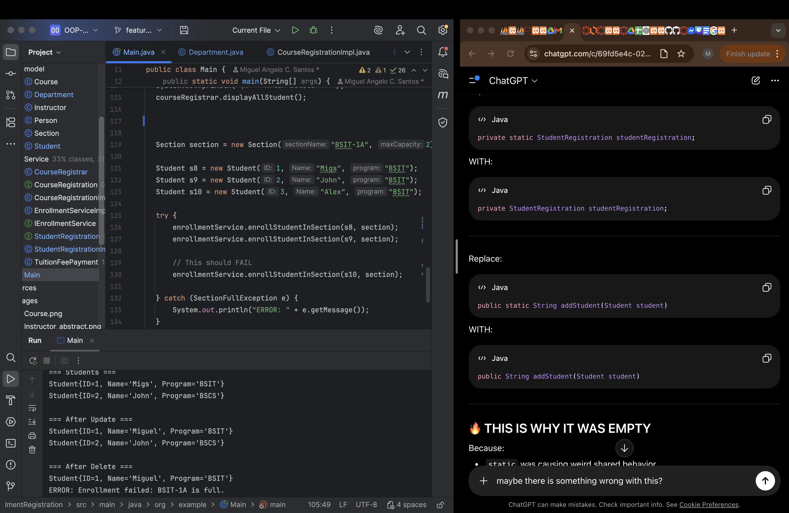

OOP - Enrollment System

---
**Author**: Miguel Santos

**1. Description** - Encapsulation of Student ID and Course ID

**Inheritance**

**ABSTRACTION**

**POLYMORPHISM**

Interfaces Used:
- StudentRegistration
- CourseRegistration
- IEnrollmentService
- IInstructorService

**CLI - STUDENT MANAGEMENT**

- Add Student
- View Student
- Update Student
- Delete Student

**CLI - INSTRUCTOR MANAGEMENT**

- Add Instructor
- View Instructor
- Update Instructor
- Delete Instructor

**CLI - COURSE MANAGEMENT**

- Add Course
- View Course
- Update Course
- Delete Course

**ENROLLMENT SYSTEM**

- Enroll Student
- View Department Hierarchy
- Section Capacity Validation

**CUSTOM EXCEPTION**

The system uses `SectionFullException`
to prevent students from enrolling in full sections.

**AUTOMATED TESTING (JUnit)**

- Tuition Tests
- Enrollment Tests
- Validation Tests

